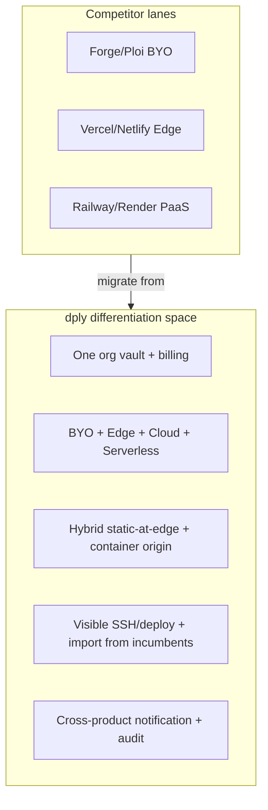

# dply differentiation ideas

Status: **backlog** · Branch: `feature/differentiation-ideas`

A scannable backlog of product concepts that lean into dply's multi-engine architecture. Each idea maps to existing code where possible so you can pick winners without greenfield guesswork.

## Positioning anchor

Most competitors own **one lane**:

| Competitor | Lane |
|------------|------|
| Laravel Forge / Ploi | BYO PHP VMs |
| Vercel / Netlify / Cloudflare Pages | Edge / static / SSR |
| Railway / Render | Managed PaaS |

**dply's moat:** honest multi-runtime ops in one org — BYO VMs, Edge, Cloud, and Serverless share vault, billing, notifications, and infrastructure hub. Ideas below should reinforce that, not copy single-product features.

---

## How to use this doc

Each idea includes:

- **Pitch** — one-line value prop
- **Why defensible** — why Forge/Vercel/Railway can't easily match
- **Builds on** — existing code, docs, or roadmap phases
- **Engines** — which product lines it touches
- **Flag** — suggested Pennant gate (if any)

Score ideas when prioritizing (1 = low, 5 = high):

| Dimension | Question |
|-----------|----------|
| **Defensibility** | Hard for incumbents to copy without architectural rewrite? |
| **Leverage** | Reuses shipped code vs greenfield? |
| **Revenue** | Drives Pro upgrades, migrations, or retention? |
| **Story** | One-sentence homepage pitch? |

---

## Tier A — Ship on existing rails

High signal, lower risk. Extends code you already have; feels new to users but isn't greenfield.

### Unified Ops Timeline

**Pitch:** One org-wide activity feed — deploys, rollbacks, domain changes, cert renewals, server drift — filterable by product line.

**Why defensible:** Forge shows server events; Vercel shows deploys. Neither spans BYO + Edge + Cloud + Serverless in one org-scoped timeline.

**Builds on:**

- Wave E audit log — [`docs/edge-roadmap-next.md`](edge-roadmap-next.md) (P9c)
- `workspace.activity` tab — [`config/features.php`](../config/features.php)
- Fleet deploys UI — [`app/Livewire/Fleet/Deploys.php`](../app/Livewire/Fleet/Deploys.php)

**Engines:** BYO, Edge, Cloud, Serverless

**Flag:** `surface.fleet` or new `surface.ops_timeline`

| Defensibility | Leverage | Revenue | Story |
|:---:|:---:|:---:|:---:|
| 4 | 4 | 4 | 4 |

---

### Deploy Intelligence Alerts

**Pitch:** Proactive alerts — "build 40% slower than p50", "prod env missing key from preview", "TLS expires in 7 days" — routed through existing notification channels.

**Why defensible:** Broad channel support (Slack, Discord, Telegram, Teams, webhooks) at org/user/team scope is rare; wiring intelligence across engines is harder for single-lane hosts.

**Builds on:**

- Wave E deploy notifications — [`docs/edge-roadmap-next.md`](edge-roadmap-next.md) (P9b)
- Notification channels — [`app/Models/NotificationChannel.php`](../app/Models/NotificationChannel.php)
- Bulk assignment UI — [`app/Livewire/Concerns/ManagesNotificationChannels.php`](../app/Livewire/Concerns/ManagesNotificationChannels.php)

**Engines:** Edge (first), then BYO deploy events, Cloud

**Flag:** ship with Wave E; optional `global.deploy_intelligence`

| Defensibility | Leverage | Revenue | Story |
|:---:|:---:|:---:|:---:|
| 4 | 5 | 5 | 4 |

---

### Fleet Command Center GA

**Pitch:** Turn on `surface.fleet` as the Infrastructure home — health, env search, domain inventory, failed deploys across BYO + Edge + Cloud.

**Why defensible:** No Forge/Vercel equivalent for cross-product fleet ops in one dashboard.

**Builds on:**

- [`app/Livewire/Fleet/Health.php`](../app/Livewire/Fleet/Health.php)
- [`app/Livewire/Fleet/EnvSearch.php`](../app/Livewire/Fleet/EnvSearch.php)
- [`app/Livewire/Fleet/Domains.php`](../app/Livewire/Fleet/Domains.php)
- [`app/Console/Commands/FleetDoctorCommand.php`](../app/Console/Commands/FleetDoctorCommand.php)
- Infrastructure hub — [`app/Livewire/Infrastructure/Index.php`](../app/Livewire/Infrastructure/Index.php)

**Engines:** BYO, Edge, Cloud

**Flag:** `surface.fleet` (exists; default off)

| Defensibility | Leverage | Revenue | Story |
|:---:|:---:|:---:|:---:|
| 5 | 5 | 4 | 5 |

---

### Cross-product env drift

**Pitch:** Compare env vars across preview vs prod and across linked Edge + Cloud + BYO sites from the same Git repo.

**Why defensible:** Env management is siloed per platform today; cross-engine drift detection requires the unified org model.

**Builds on:**

- Fleet env search — [`app/Livewire/Fleet/EnvSearch.php`](../app/Livewire/Fleet/EnvSearch.php)
- Edge env API/CLI (deferred from Wave A) — [`docs/edge-roadmap-next.md`](edge-roadmap-next.md)
- Site/repo linkage across product lines

**Engines:** Edge, Cloud, BYO

**Flag:** `surface.fleet` or `workspace.env_drift`

| Defensibility | Leverage | Revenue | Story |
|:---:|:---:|:---:|:---:|
| 4 | 3 | 4 | 4 |

---

### Compliance export pack

**Pitch:** One-click ZIP export — audit log, deploy history, cert status, access rules — for SOC2-minded teams.

**Why defensible:** Transparency positioning + multi-engine audit trail in one export is a sales wedge vs opaque panels.

**Builds on:**

- Wave E audit — [`docs/edge-roadmap-next.md`](edge-roadmap-next.md) (P9c)
- Certificate models and deploy history (BYO + Edge)
- Edge access rules — [`EdgeSiteAccessRule`](../app/Models/EdgeSiteAccessRule.php) (preview protection)

**Engines:** All

**Flag:** Pro tier or `global.compliance_export`

| Defensibility | Leverage | Revenue | Story |
|:---:|:---:|:---:|:---:|
| 3 | 3 | 5 | 3 |

---

### Import → parity dashboard

**Pitch:** After Forge/Ploi/Vercel import, show "what we migrated" plus ongoing drift vs source — not a one-shot handoff.

**Why defensible:** Import wizards exist elsewhere; **continuous parity** after migration is a retention hook competitors skip.

**Builds on:**

- Forge/Ploi import routes — [`routes/web.php`](../routes/web.php)
- Edge importers — [`docs/edge-roadmap-next.md`](edge-roadmap-next.md) (Wave C P11a)
- Fleet doctor drift patterns — [`FleetDoctorCommand`](../app/Console/Commands/FleetDoctorCommand.php)

**Engines:** BYO, Edge

**Flag:** none (onboarding enhancement)

| Defensibility | Leverage | Revenue | Story |
|:---:|:---:|:---:|:---:|
| 4 | 4 | 5 | 5 |

---

## Tier B — True differentiators

Medium effort; competitors would need architectural rewrites to match.

### Full-stack from one repo

**Pitch:** Repo detect → auto-provision Edge front + Cloud API + BYO database with wiring docs and private networking hints.

**Status:** **Wizard v1 shipped** on `feature/tier-b-workflows` — see [`TIER_B_WORKFLOW.md`](TIER_B_WORKFLOW.md).

**Why defensible:** Only dply has hybrid Edge+Cloud stack **and** BYO in one org. Vercel can't provision your VPS; Forge can't deploy to Workers.

**Builds on:**

- [`app/Actions/Edge/CreateHybridEdgeStack.php`](../app/Actions/Edge/CreateHybridEdgeStack.php)
- Runtime detection — [`app/Services/Deploy/RuntimeDetection/`](../app/Services/Deploy/RuntimeDetection/)
- Launchpad — [`multi_surface_active()`](../app/helpers.php), `/launches/create`

**Engines:** Edge, Cloud, BYO

**Flag:** `surface.cloud` + `surface.edge`; new `launch.full_stack_wizard`

| Defensibility | Leverage | Revenue | Story |
|:---:|:---:|:---:|:---:|
| 5 | 3 | 5 | 5 |

---

### `dply.yaml` everywhere

**Pitch:** Extend declarative in-repo config beyond Edge — BYO redirects, cron, deploy hooks, notification rules in one file.

**Status:** **BYO sync v1 shipped** — redirects, crons (`command`), deploy hooks; see [`TIER_B_WORKFLOW.md`](TIER_B_WORKFLOW.md).

**Why defensible:** Vercel/Netlify have platform-specific config; Forge has almost none. **Cross-engine** declarative config is novel.

**Builds on:**

- Edge `dply.yaml` — [`docs/edge-roadmap-next.md`](edge-roadmap-next.md) (Phase 6)
- [`EdgeRepoConfigLinter`](../app/Services/Edge/EdgeRepoConfigLinter.php)
- BYO site routing/deploy settings

**Engines:** Edge (seed), BYO, Cloud

**Flag:** extend existing Edge config; no new flag for BYO until stable

| Defensibility | Leverage | Revenue | Story |
|:---:|:---:|:---:|:---:|
| 5 | 3 | 4 | 4 |

---

### Deploy replay / shadow traffic

**Pitch:** Replay sampled production requests against a preview deployment before promote — smoke test with real traffic shapes.

**Status:** **v1 shipped** — GET/HEAD sampler + preview HTTP replay on Previews tab; see [`TIER_B_WORKFLOW.md`](TIER_B_WORKFLOW.md).

**Why defensible:** Edge Wave D already ships sticky A/B split; extending to request replay across BYO/Cloud is a natural moat extension.

**Builds on:**

- Split traffic — [`docs/edge-roadmap-next.md`](edge-roadmap-next.md) (P10d, Wave D)
- Edge access logs + live tail (P9a)
- BYO deploy hooks

**Engines:** Edge (first), BYO, Cloud

**Flag:** `edge.split_traffic` (shipped) + new `deploy.replay`

| Defensibility | Leverage | Revenue | Story |
|:---:|:---:|:---:|:---:|
| 4 | 3 | 4 | 4 |

---

### Transparent cost observatory

**Pitch:** Dashboard showing BYO VM tier fees + estimated cloud spend + Edge/Cloud metered usage in one pane, with honest "vs Forge flat fee" framing.

**Why defensible:** Matches org-based billing model — [`docs/BILLING_AND_PLANS.md`](BILLING_AND_PLANS.md). Competitors bundle or hide infra costs differently.

**Builds on:**

- Org billing — [`app/Livewire/Billing/Show.php`](../app/Livewire/Billing/Show.php)
- Edge usage snapshots — [`docs/EDGE_BILLING.md`](EDGE_BILLING.md)
- Server provider cost catalogs — [`config/server_providers.php`](../config/server_providers.php)

**Engines:** All

**Flag:** `global.billing_enabled`

| Defensibility | Leverage | Revenue | Story |
|:---:|:---:|:---:|:---:|
| 4 | 3 | 5 | 5 |

---

### Preview review hub

**Pitch:** Expand preview comments into PR-linked design review — annotations, threads, approve-to-promote workflow.

**Why defensible:** Vercel has deploy comments; tying **BYO preview URLs + Edge previews** under one review hub is wider coverage.

**Builds on:**

- [`app/Livewire/Sites/EdgePreviewComments.php`](../app/Livewire/Sites/EdgePreviewComments.php)
- [`docs/EDGE_PREVIEW_COMMENTS.md`](EDGE_PREVIEW_COMMENTS.md)
- Edge promote/rollback — Wave A (P7a)

**Engines:** Edge, BYO (preview hostnames)

**Flag:** none initially

| Defensibility | Leverage | Revenue | Story |
|:---:|:---:|:---:|:---:|
| 3 | 4 | 3 | 4 |

---

### Runbook marketplace

**Pitch:** Curated + community scripts and saved commands with one-click import to a server or org-wide library.

**Why defensible:** Forge has recipes; dply can span **org-wide automation** across all servers and product lines.

**Builds on:**

- `surface.marketplace` — [`config/features.php`](../config/features.php)
- Saved commands + scripts workspace surfaces
- Server marketplace import flows

**Engines:** BYO (primary), org-wide scripts

**Flag:** `surface.marketplace`, `surface.scripts`

| Defensibility | Leverage | Revenue | Story |
|:---:|:---:|:---:|:---:|
| 3 | 4 | 4 | 3 |

---

### Ephemeral deploy credentials

**Pitch:** Per-deploy SSH keys or API tokens that auto-revoke after deploy completes — auditable, time-boxed access.

**Why defensible:** Security + transparency story Forge/Ploi don't emphasize; fits "you own the metal" positioning.

**Builds on:**

- SSH key sync — [`server_authorized_keys`](../app/Models/ServerAuthorizedKey.php) patterns
- Deploy job lifecycle — [`RunSiteDeploymentJob`](../app/Jobs/RunSiteDeploymentJob.php)
- Audit log (Wave E)

**Engines:** BYO

**Flag:** `workspace.ephemeral_credentials` (new)

| Defensibility | Leverage | Revenue | Story |
|:---:|:---:|:---:|:---:|
| 4 | 2 | 3 | 4 |

---

## Tier C — Moonshots

Bold, longer horizon. Pick one for a headline feature.

### Ops Copilot for vibe-coded apps

**Pitch:** AI reads deploy logs, nginx config, `dply.yaml`, and saved commands → suggests fixes. Positioned as the **ops layer for AI-built repos**.

**Why defensible:** Features page already frames dply as complement to AI builders — [`resources/views/features.blade.php`](../resources/views/features.blade.php). Cross-engine context is the differentiator vs generic ChatGPT.

**Builds on:** TaskRunner output, deploy logs, site/server config, docs slide-over

**Engines:** All

**Flag:** `global.ops_copilot` (new, gated indefinitely)

| Defensibility | Leverage | Revenue | Story |
|:---:|:---:|:---:|:---:|
| 4 | 2 | 4 | 5 |

---

### Blast-radius graph

**Pitch:** Visual map — server → sites → Edge origins → databases. Answer "what breaks if X fails?"

**Why defensible:** Requires unified inventory across engines; single-lane hosts only see their slice.

**Builds on:** Infrastructure hub, hybrid stack links, server/site/edge relationships

**Engines:** All

**Flag:** `surface.fleet` + new graph UI

| Defensibility | Leverage | Revenue | Story |
|:---:|:---:|:---:|:---:|
| 5 | 2 | 4 | 5 |

---

### Multi-cloud standby blueprints

**Pitch:** Opinionated failover playbooks — Edge origin swap, BYO standby server, DNS runbooks. Not full HA; honest, actionable steps.

**Why defensible:** dply spans edge + origin + BYO; can document cross-layer failover others can't.

**Builds on:** Hybrid SSR docs, DNS automation, server create flows

**Engines:** Edge, Cloud, BYO

**Flag:** docs + wizard; optional `launch.standby_blueprint`

| Defensibility | Leverage | Revenue | Story |
|:---:|:---:|:---:|:---:|
| 4 | 2 | 3 | 4 |

---

### Edge + BYO unified preview URLs

**Pitch:** Same preview hostname pattern across VM sites and Edge previews under org testing domains.

**Why defensible:** Reduces cognitive load for teams running PHP API on BYO + Next front on Edge.

**Builds on:** [`DPLY_TESTING_DOMAINS`](../config/dply.php), [`EdgeTestingDomains`](../app/Support/EdgeTestingDomains.php), BYO preview routing

**Engines:** Edge, BYO

**Flag:** none

| Defensibility | Leverage | Revenue | Story |
|:---:|:---:|:---:|:---:|
| 3 | 3 | 3 | 3 |

---

### Serverless as glue

**Pitch:** OpenWhisk sequences connecting Edge webhooks → Cloud APIs → BYO cron — orchestration without leaving dply.

**Why defensible:** Unique to multi-engine control plane; Railway/Vercel can't wire your VPS cron.

**Builds on:** [`docs/serverless-openwhisk-roadmap.md`](serverless-openwhisk-roadmap.md), Edge deploy hooks (P10b)

**Engines:** Serverless, Edge, Cloud, BYO

**Flag:** `surface.serverless`

| Defensibility | Leverage | Revenue | Story |
|:---:|:---:|:---:|:---:|
| 5 | 2 | 3 | 4 |

---

## Tier D — Quick wins (positioning + polish)

Low engineering, high perception. No Pennant flags required.

| Item | Action | Reference |
|------|--------|-----------|
| README accuracy | Update to reflect Cloud/Edge/Serverless shipped (gated) | [`README.md`](../README.md) vs [`AGENTS.md`](../AGENTS.md) |
| Migration landing pages | "Migrate in an afternoon" per incumbent → import wizards | Forge/Ploi import, Edge `/edge/import` |
| Deploy badge | Public README badge for template gallery | Wave C P11c — [`docs/edge-roadmap-next.md`](edge-roadmap-next.md) |
| API + CLI headline | Market Edge OpenAPI + `dply` CLI on features/pricing | [`public/openapi/edge.json`](../public/openapi/edge.json), [`packages/dply-cli/`](../packages/dply-cli/) |

---

## Prioritization summary

Pre-scored totals (Defensibility + Leverage + Revenue + Story):

| Rank | Idea | Total | Tier |
|------|------|-------|------|
| 1 | Fleet Command Center GA | 19 | A |
| 2 | Full-stack from one repo | 18 | B |
| 3 | Deploy Intelligence Alerts | 18 | A |
| 4 | Import → parity dashboard | 18 | A |
| 5 | Transparent cost observatory | 17 | B |
| 6 | Unified Ops Timeline | 16 | A |
| 7 | Blast-radius graph | 16 | C |
| 8 | Ops Copilot for vibe-coded apps | 15 | C |
| 9 | `dply.yaml` everywhere | 16 | B |
| 10 | Cross-product env drift | 15 | A |

### Recommended first picks

If you want **maximum differentiation with least risk**:

1. **Fleet Command Center GA** — surfaces hidden value already built behind `surface.fleet`
2. **Unified Ops Timeline + Deploy Intelligence** — Wave E; leverages notification moat
3. **Full-stack from one repo** — headline no single competitor can claim

---

## Suggested follow-up branches

| Branch | Scope |
|--------|--------|
| `feature/wave-e-org-maturity` | P9b notifications, P9c audit, Edge site members (P12) |
| `feature/fleet-command-center` | Enable + polish `surface.fleet` UI |
| `feature/full-stack-detect` | Spike repo → Edge + Cloud + BYO wiring wizard |

---

## Related docs

- [Edge roadmap — next phases](edge-roadmap-next.md) — Wave E sequencing
- [ROADMAPS.md](ROADMAPS.md) — compiled product roadmaps
- [BILLING_AND_PLANS.md](BILLING_AND_PLANS.md) — org pricing model
- [ORG_ROLES_AND_LIMITS.md](ORG_ROLES_AND_LIMITS.md) — team/RBAC foundation
- [edge-product-boundary ADR](adr/edge-product-boundary.md) — Edge vs Cloud vs BYO boundaries
